# Diagrammi Architetturali – MVP

> Diagrammi C4, sequenze, state machine e struttura dati.
> Tutti i diagrammi usano sintassi **Mermaid** (renderizzabile su GitHub, VSCode, Notion, Obsidian).

---

## Indice

1. [C4 Level 1 – Contesto di sistema](#c4-level-1--contesto-di-sistema)
2. [C4 Level 2 – Container](#c4-level-2--container)
3. [C4 Level 3 – Componenti Document Processing](#c4-level-3--componenti-document-processing)
4. [C4 Level 3 – Componenti AI Generator](#c4-level-3--componenti-ai-generator)
5. [Diagramma di Sequenza – Estrazione PDF](#diagramma-di-sequenza--estrazione-pdf)
6. [Diagramma di Sequenza – Generazione Contenuti AI](#diagramma-di-sequenza--generazione-contenuti-ai)
7. [State Machine – ExtractedDocument](#state-machine--extracteddocument)
8. [State Machine – ProcessingRun](#state-machine--processingrun)
9. [Modello ER semplificato](#modello-er-semplificato)
10. [Architettura Deploy](#architettura-deploy)
11. [Pipeline CI/CD](#pipeline-cicd)

---

## C4 Level 1 – Contesto di sistema

Mostra il sistema nel suo contesto: chi lo usa e con quali sistemi esterni interagisce.

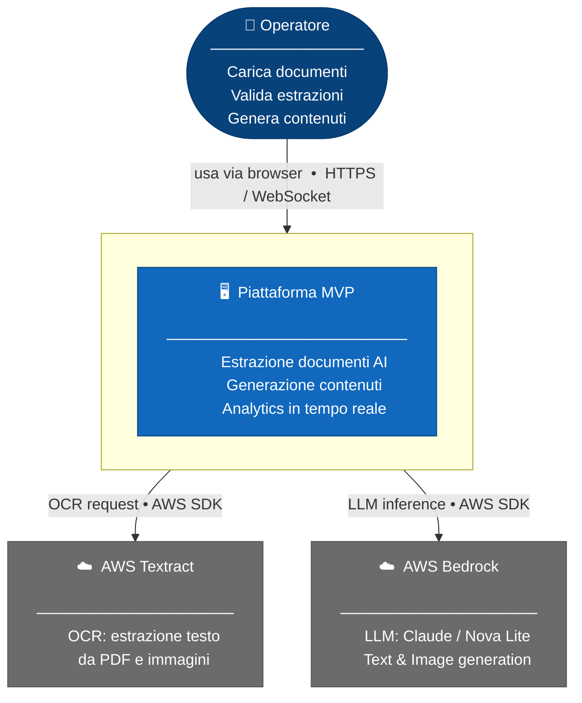

---

## C4 Level 2 – Container

Mostra i container (processi/deployment unit) che compongono il sistema.

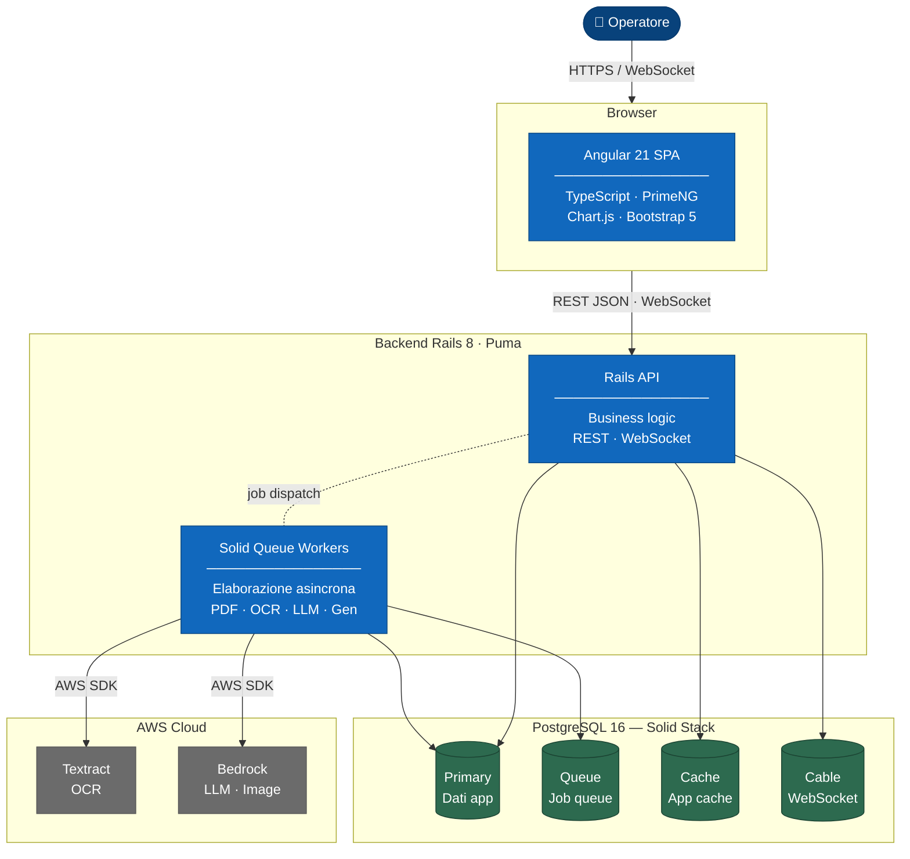

---

## C4 Level 3 – Componenti Document Processing

Dettaglio del modulo principale di estrazione documenti nel backend.
Lettura da sinistra a destra: ogni colonna è uno strato architetturale.

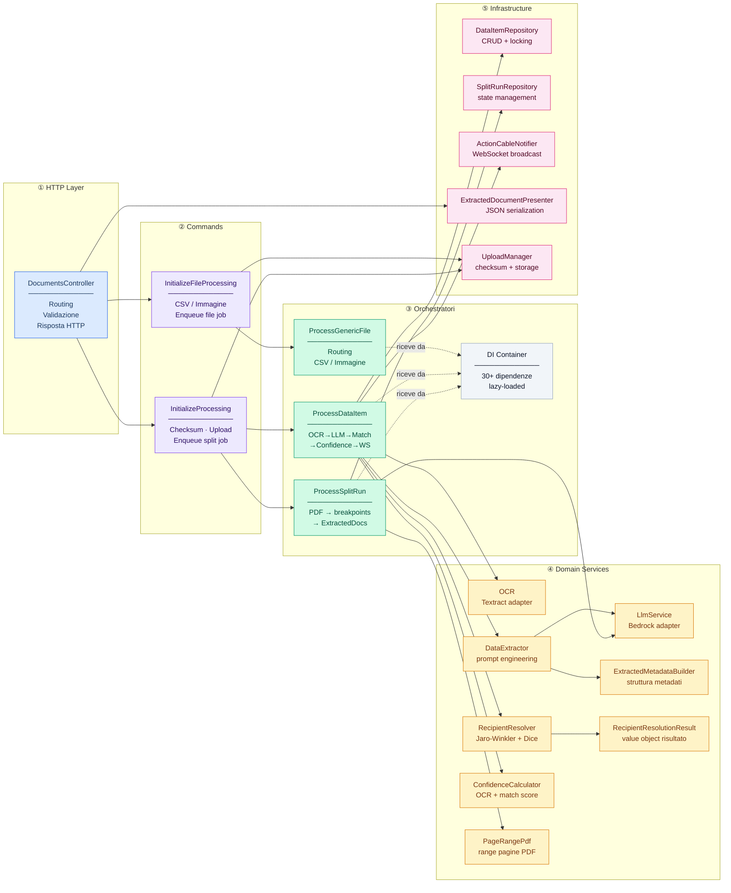

---

## C4 Level 3 – Componenti AI Generator

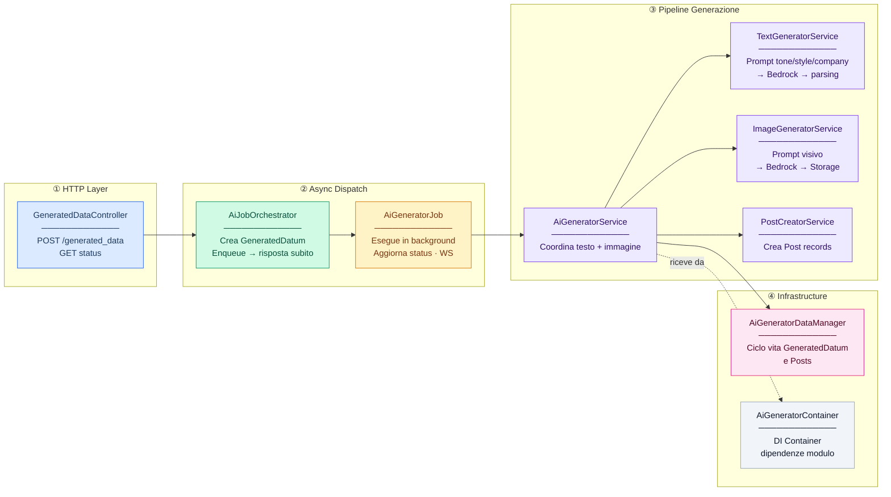

---

## Diagramma di Sequenza – Estrazione PDF

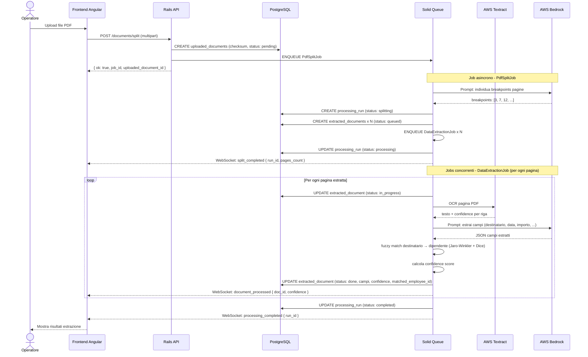

---

## Diagramma di Sequenza – Generazione Contenuti AI

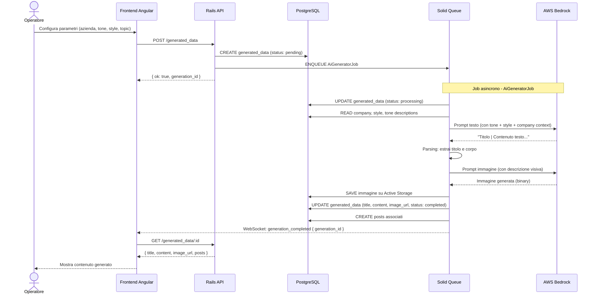

---

## State Machine – ExtractedDocument

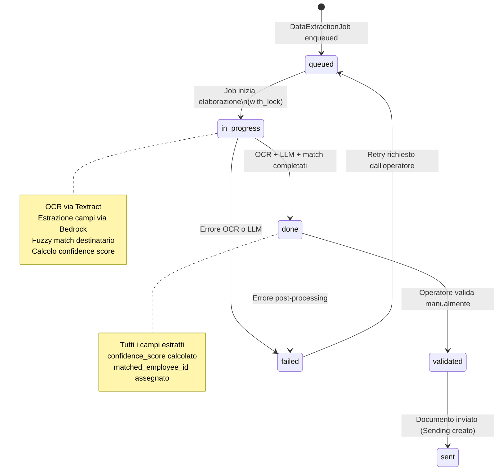

---

## State Machine – ProcessingRun

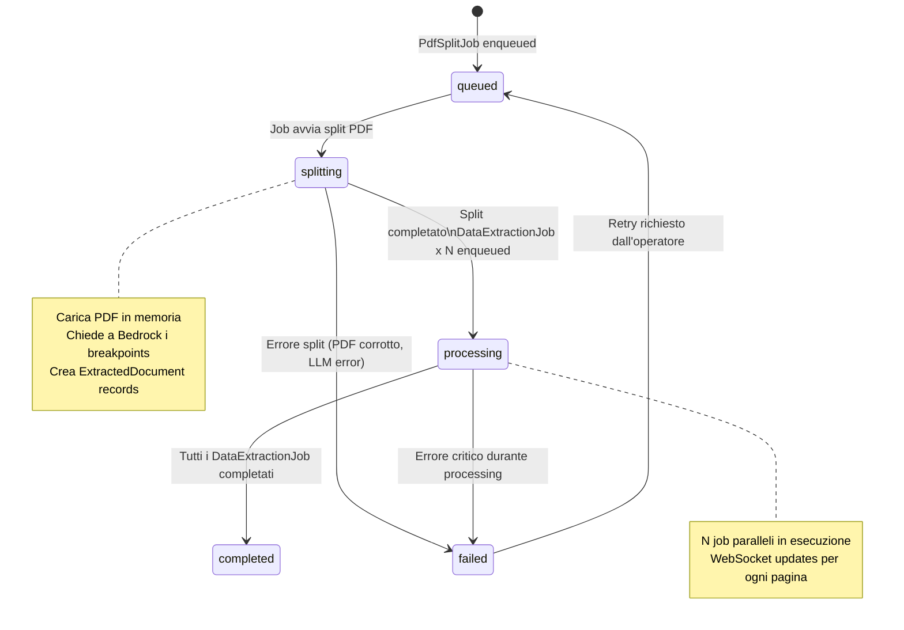

---

## Modello ER semplificato

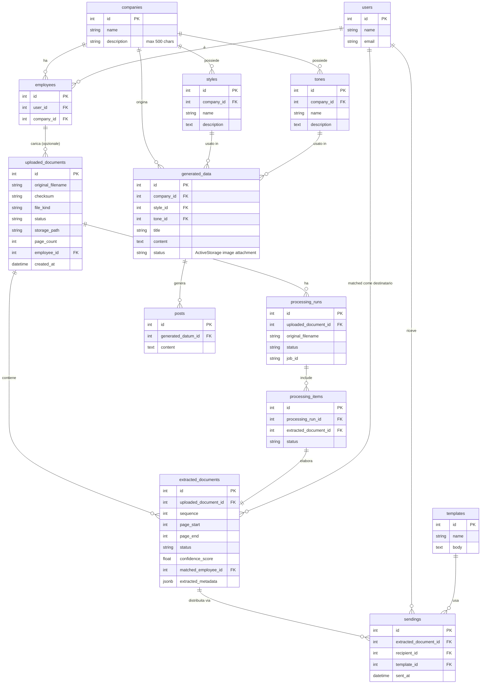

---

## Architettura Deploy

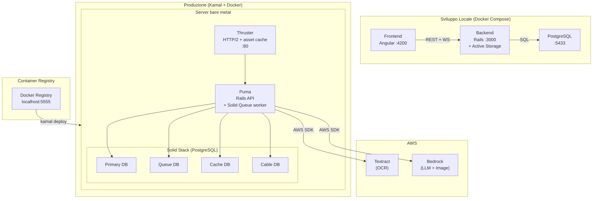

---

## Pipeline CI/CD

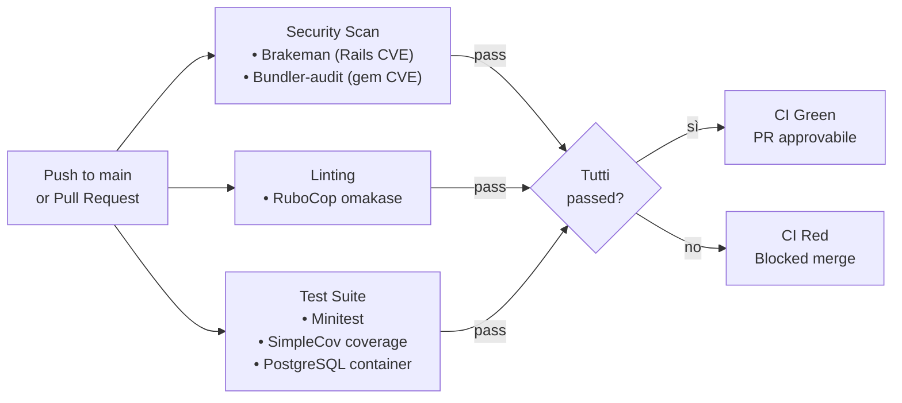

---

*Documento generato dall'analisi del codice sorgente. Per la documentazione testuale completa vedere [ARCHITECTURE.md](ARCHITECTURE.md).*
